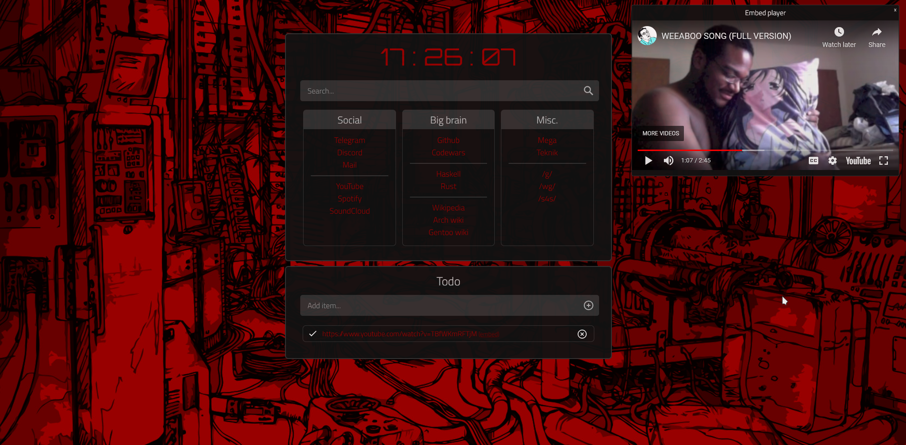

<div align="center">
  <h1>Browser homepage</h1>
  <b>My browser homepage.</b> You can try it <a href="https://r4v10l1.github.io/browser-homepage/homepage.html">here</a>.<br>
  <p>Inspired by <a href="https://boards.4chan.org/wg/thread/7801612">/wg/</a>, <a href="https://boards.4chan.org/wg/thread/7801612#p7822666">anon</a> and <a href="https://boards.4chan.org/wg/thread/7801612#p7827588">anon</a>.</p>
  <a href="https://github.com/r4v10l1/browser-homepage/network/members"></a>
  <a href="https://github.com/r4v10l1/browser-homepage/stargazers"></a>
</div>

# Table of contents
1. [How it works](https://github.com/r4v10l1/browser-homepage#How-it-works)
2. [Changes](https://github.com/r4v10l1/browser-homepage#Changes)
3. [Making it your home page](https://github.com/r4v10l1/browser-homepage#Making-it-your-home-page)
4. [Search engines](https://github.com/r4v10l1/browser-homepage#Search-engines)
5. [Screenshots](https://github.com/r4v10l1/browser-homepage#Screenshots)
6. [Todo](https://github.com/r4v10l1/browser-homepage#Todo)

## How it works

- The todo list uses [localstorage](https://blog.logrocket.com/localstorage-javascript-complete-guide/) to store the todo items.
- You can mark items as done or delete them.
- The container size changes depending on the ammount of todo items.
- If a youtube video is added to the todo list, adds a [`(embed)`](https://github.com/r4v10l1/youtube-embed-window) button to open the embed video window, which can be moved.

## Changes

- Added a bit of transparency to main container.
- Added todo list.
- Changed height, margins and sizes (Very easy to change)
- Added search engines using [keywords](https://github.com/r4v10l1/browser-homepage/blob/main/js/search-bar.js#L5) in the search bar.
- JS is now in different files.
- Fixed background repeat thing. Now it covers all the screen. THE SCREENSHOTS ARE STILL WITH THE REPEATED BACKGROUND.
- Now it won't capitalize links.
- Now it will add `<a href="">` to the todo item if it's a link (Makes links clickable). 
- Now the size of the bookmarks changes depending on the items. For real now.
- Added embed styles, window and embed button depending on the todolist.

## Making it your home page
You can set the [page link](https://r4v10l1.github.io/browser-homepage/homepage.html) as your homepage, but that is probably not pretty and the address bar won't be empty. For firefox at least, there is a [guide](https://stpg.tk/guides/firefox-startpage/) on how to do it on any platform, which I will explain here.

#

The firefox folder is usually:
- Windows: `C:\Program Files\Mozilla Firefox\`
- macOS: `/Applications/Firefox.app/Contents/MacOS`
- Linux: `/opt/firefox/` or `/usr/lib/firefox/`

#

Add this to `autoconfig.js` located in `<firefox-folder>/defaults/pref` (Create it if it does not exist)
```js
pref("general.config.filename", "mozilla.cfg");
pref("general.config.obscure_value", 0);
pref("general.config.sandbox_enabled", false);
```
Edit the `mozilla.cfg` file in your main firefox folder.
```js
// Any comment. You must start the file with a single-line comment!

let { classes:Cc, interfaces:Ci, utils:Cu } = Components;

try {
  Cu.import("resource:///modules/AboutNewTab.jsm");
  let newTabURL = "PATH_TO_STARTPAGE_REPLACE_ME";
  AboutNewTab.newTabURL = newTabURL;
} catch(e) { Cu.reportError(e); }
```
`PATH_TO_STARTPAGE_REPLACE_ME` should be replaced with the file path to your startpage.

For example `file:///home/user/Documents/startpage/index.html`. Yes, you need to use the `file://` thing in every platform.

## Search engines
Keyword       | Search engine
--------------|-----------------------
<kbd>d</kbd>  | `https://www.duckduckgo.com/?q=`
<kbd>dd</kbd> | `https://html.duckduckgo.com/html/?q=`
<kbd>g</kbd>  | `https://www.google.com/search?q=`
<kbd>s</kbd>  | `https://searx.gnous.eu/search?q=`
<kbd>yt</kbd> | `https://www.youtube.com/results?search_query=`

## Screenshots


## Todo
- `todo.js` applies the `<a>` tag to the whole todo element instead of the link only. (Now it works only if the link is the only content of the todo element)
- The embed youtube window only displays the last youtube video added. Maybe store a list of videos by id?
