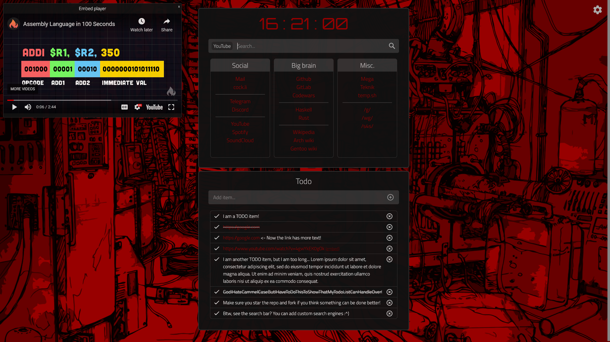

<div align="center">
  <h1>Browser homepage</h1>
  <b>My browser homepage.</b> You can try it <a href="https://r4v10l1.github.io/browser-homepage/homepage.html">here</a>.<br>
  <p>Inspired by <a href="https://boards.4chan.org/wg/thread/7801612">/wg/</a>, <a href="https://boards.4chan.org/wg/thread/7801612#p7822666">anon</a> and <a href="https://boards.4chan.org/wg/thread/7801612#p7827588">anon</a>.</p>
  <a href="https://github.com/r4v10l1/browser-homepage/network/members"></a>
  <a href="https://github.com/r4v10l1/browser-homepage/stargazers"></a>
</div>

# Table of contents
1. [How it works](#How-it-works)
2. [Making it your home page](#Making-it-your-home-page)
3. [Search engines](#Search-engines)
4. [Contributing](#Contributing)
5. [Changes](#Changes)
6. [Todo](#Todo)
7. [Screenshots](#Screenshots)

## How it works

- The todo list uses [localstorage](https://blog.logrocket.com/localstorage-javascript-complete-guide/) to store the todo items.
- You can mark items as done or delete them.
- The container size changes depending on the ammount of todo items.
- If a youtube video is added to the todo list, adds a [`(embed)`](https://github.com/r4v10l1/youtube-embed-window) button to open the embed video window, which can be moved.

## Making it your home page
You can set the [page link](https://r4v10l1.github.io/browser-homepage/homepage.html) as your homepage, but that is probably not pretty and the address bar won't be empty. For firefox at least, there is a [guide](https://stpg.tk/guides/firefox-startpage/) on how to do it on any platform, which I will explain here.

#

The firefox folder is usually:
- Windows: `C:\Program Files\Mozilla Firefox\`
- macOS: `/Applications/Firefox.app/Contents/MacOS`
- Linux: `/opt/firefox/` or `/usr/lib/firefox/`

#

Add this to `autoconfig.js` located in `<firefox-folder>/defaults/pref` (Create it if it does not exist)
```js
pref("general.config.filename", "mozilla.cfg");
pref("general.config.obscure_value", 0);
pref("general.config.sandbox_enabled", false);
```
Edit the `mozilla.cfg` file in your main firefox folder.
```js
// Any comment. You must start the file with a single-line comment!

let { classes:Cc, interfaces:Ci, utils:Cu } = Components;

try {
  Cu.import("resource:///modules/AboutNewTab.jsm");
  let newTabURL = "PATH_TO_STARTPAGE_REPLACE_ME";
  AboutNewTab.newTabURL = newTabURL;
} catch(e) { Cu.reportError(e); }
```
`PATH_TO_STARTPAGE_REPLACE_ME` should be replaced with the file path to your startpage.

For example `file:///home/user/Documents/startpage/index.html`. Yes, you need to use the `file:///` thing in every platform.

## Search engines
Keyword       | Search engine
--------------|-----------------------
<kbd>d</kbd>  | `https://www.duckduckgo.com/?q=`
<kbd>dd</kbd> | `https://html.duckduckgo.com/html/?q=`
<kbd>g</kbd>  | `https://www.google.com/search?q=`
<kbd>s</kbd>  | `https://searx.gnous.eu/search?q=`
<kbd>yt</kbd> | `https://www.youtube.com/results?search_query=`

## Contributing
Check [CONTRIBUTE.md](https://github.com/r4v10l1/browser-homepage/blob/main/CONTRIBUTE.md).

## Changes

- Added a bit of transparency to main container.
- Added todo list.
- Changed height, margins and sizes (Very easy to change)
- Added search engines using [keywords](https://github.com/r4v10l1/browser-homepage/blob/main/js/search-bar.js#L5) in the search bar.
- JS is now in different files.
- Fixed background repeat thing. Now it covers all the screen. THE SCREENSHOTS ARE STILL WITH THE REPEATED BACKGROUND.
- Now it won't capitalize links.
- Now it will add `<a href="">` to the todo item if it's a link (Makes links clickable). 
- Now the size of the bookmarks changes depending on the items. For real now.
- Added embed styles, window and embed button depending on the todolist.
- Added fixed width to the main and todo containers, so it doesnt resize with the window. Margins are now auto instead of the 23% used before.
- Changed default position of the embed video window. Now it spawns in the left side, in a fixed position, instead of 70%, which could make the window spawn with half outside of the browser on smaller resolutions.
- Added [function](https://github.com/r4v10l1/browser-homepage/commit/51d4e2e8c3f6ff98d7942d53aea73008403f047f#diff-69e1955059041300b9d121a61837651363f6e92e23f5683ea9aa8fc62f1a6bf5R38) for shortening links, instead of fixed values depending on the type of link (youtube, etc.). Now they are parameters. It also made the regular text check for possible overflows to prevent the text and the remove button from going outside of the container ([Later removed](https://github.com/r4v10l1/browser-homepage/commit/51d4e2e8c3f6ff98d7942d53aea73008403f047f#diff-69e1955059041300b9d121a61837651363f6e92e23f5683ea9aa8fc62f1a6bf5R38)).
- Now the text itself of the todo item has it's class and all, but making that change made the `display: block;` mess the todo items. This was fixed by applying [`display: inline;`](https://github.com/r4v10l1/browser-homepage/commit/a8d469ea8a46040d93810149e859fbee90667d8a#diff-f131fc9dca7d0116bd2258c95e127905bb0db3b922c83db9c7648b32770fc532R212) and [`display: inline-block;`](https://github.com/r4v10l1/browser-homepage/commit/a8d469ea8a46040d93810149e859fbee90667d8a#diff-f131fc9dca7d0116bd2258c95e127905bb0db3b922c83db9c7648b32770fc532R216) to different items.
- Instead of applying the `checked` class to all the list item, now it applies it to this new class (The text only). This is now made [easily](https://github.com/r4v10l1/browser-homepage/commit/66e53ba041a0898983727ebbfa2171a65a22be7b#diff-69e1955059041300b9d121a61837651363f6e92e23f5683ea9aa8fc62f1a6bf5R49) too.
- Now the todo items also allow big texts (paragraphs) without breaking the other buttons. If it cannot justify the text (when the item is one big word), it will [remove the overflow](https://github.com/r4v10l1/browser-homepage/commit/a8d469ea8a46040d93810149e859fbee90667d8a#diff-f131fc9dca7d0116bd2258c95e127905bb0db3b922c83db9c7648b32770fc532R218).
- Now you can see an (ugly) icon when the input updates, containing the search engine. In the future you should be able to change the icons and use text instead. 
- If you use a search engine, the value of the search engine (`yt`, `g`, etc.) gets removed from the input value. Added 1 more setting (code for now) that will be checked to decide if after the value is empty with a search engine (You want to delete the search engine), the whole search engine will be deleted or you can "edit" the search engine. A bit hard to explain, but easy to see when changing `delete_whole_se` in the code and trying to delete the search engine.
- Added text mode for search engines

## Todo
- [X] `todo.js` applies the `<a>` tag to the whole todo element instead of the link only. (Now it works only if the link is the only content of the todo element)
- [X] The embed youtube window only displays the last youtube video added. ~Maybe store a list of videos by id?~ Added different ids as arguments in the html.
- [X] Detect search engine before actually searching and display it in the search bar. ([example](screenshots/search-engines-example.png))
- [X] Add text search engines instead of (ugly) icons.
- [ ] The text added to the TODO items is only recognized **after** the link, the text before the link gets deleted. Also the none of it works with youtube links
- [ ] The todo text (container) seems a bit down on browsers like chrome (yikes) or similar. Most likely due to some default margin or padding for some value? Not on firefox. If that's the case, overwrite it.
- [ ] When using a text indicator for the search engine the search icon moves a bit to the right (The width changes)
- [ ] Add more than one theme with css (light theme based on the /g/ one)
    - [ ] Add button or something to replace the css ([Link](https://stackoverflow.com/a/19844757)).
- [ ] Add settings window/tab
    - [ ] Store choices in localstorage.
    - [ ] Theme
    - [ ] Background (solid color)
    - [ ] Search engine icons / text


## Screenshots

