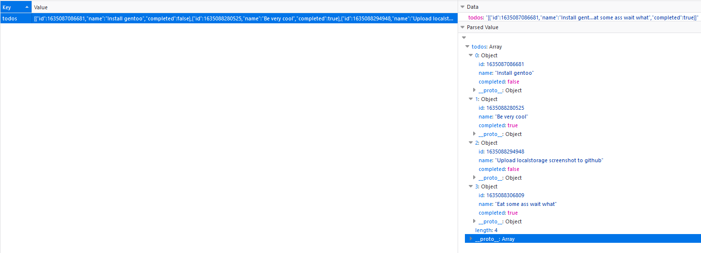
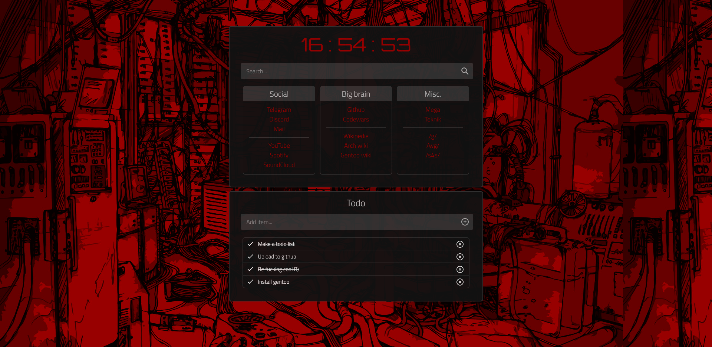
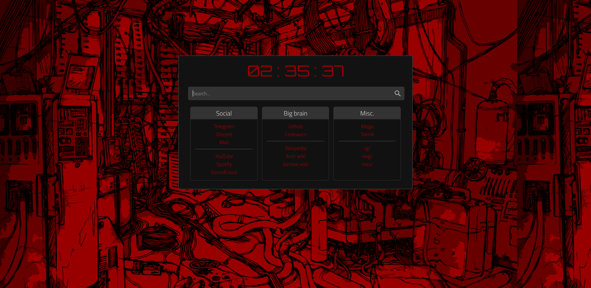

<div align="center">
  <h1>Browser homepage</h1>
  <b>My browser homepage.</b><br>
  <p>Inspired by <a href="https://boards.4chan.org/wg/thread/7801612">/wg/</a>, <a href="https://boards.4chan.org/wg/thread/7801612#p7822666">anon</a> and <a href="https://boards.4chan.org/wg/thread/7801612#p7827588">anon</a>.</p>
</div>

## Table of contents
1. [Details](https://github.com/r4v10l1/browser-homepage#Details)
2. [Changes](https://github.com/r4v10l1/browser-homepage#Changes)
3. [Firefox guide](https://github.com/r4v10l1/browser-homepage#Firefox-guide)
4. [Screenshots](https://github.com/r4v10l1/browser-homepage#Screenshots)

## Details

- The todo list uses [localstorage](https://blog.logrocket.com/localstorage-javascript-complete-guide/) to store the todo items.
  
- You can mark items as done or delete them.
- The container size changes depending on the ammount of todo items.

## Changes

- Added a bit of transparency to main container.
- Added todo list.
- Changed height, margins and sizes (Very easy to change)
- Added search engines using [keywords](https://github.com/r4v10l1/browser-homepage/blob/main/js/search-bar.js#L5) in the search bar.
- JS is now in different files.
- Fixed background repeat thing. Now it covers all the screen. THE SCREENSHOTS ARE STILL WITH THE REPEATED BACKGROUND.

## Firefox guide
[Click me](https://stpg.tk/guides/firefox-startpage/).

#

The firefox folder is usually:
- Windows: `C:\Program Files\Mozilla Firefox\`
- macOS: `/Applications/Firefox.app/Contents/MacOS`
- Linux: `/opt/firefox/`

#

Add this to `autoconfig.js` located in `FIREFOX_FOLDER/defaults/pref` (Create it if it does not exist)
```js
pref("general.config.filename", "mozilla.cfg");
pref("general.config.obscure_value", 0);
pref("general.config.sandbox_enabled", false);
```
Edit the `mozilla.cfg` file in your main firefox folder.
```cfg
// Any comment. You must start the file with a single-line comment!

let { classes:Cc, interfaces:Ci, utils:Cu } = Components;

try {
  Cu.import("resource:///modules/AboutNewTab.jsm");
  let newTabURL = "PATH_TO_STARTPAGE_REPLACE_ME";
  AboutNewTab.newTabURL = newTabURL;
} catch(e) { Cu.reportError(e); }
```
`PATH_TO_STARTPAGE_REPLACE_ME` should be replaced with the file path to your startpage.

For example `file:///home/user/Documents/startpage/index.html`.

## Screenshots

(Old)

